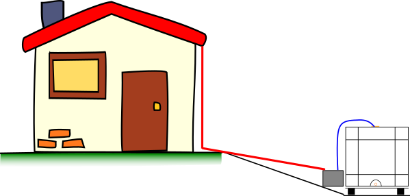
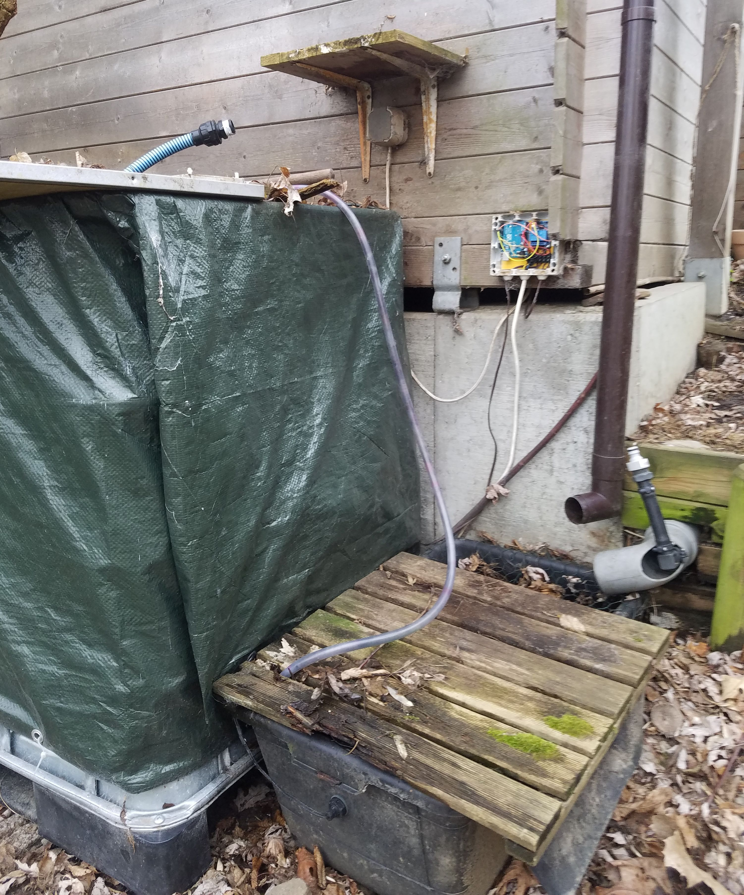
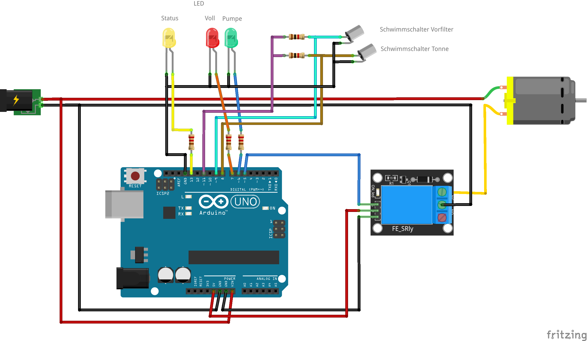
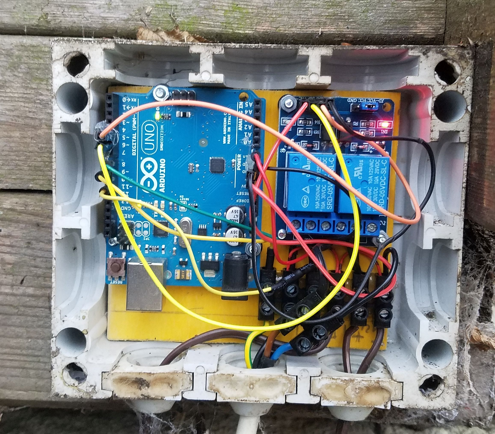
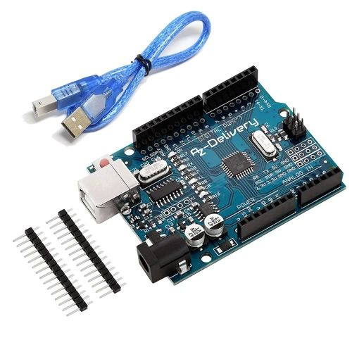
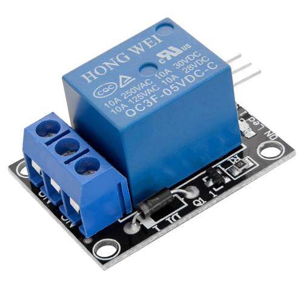
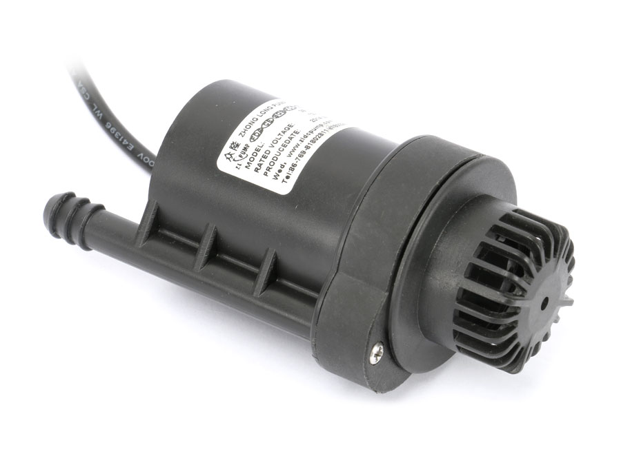
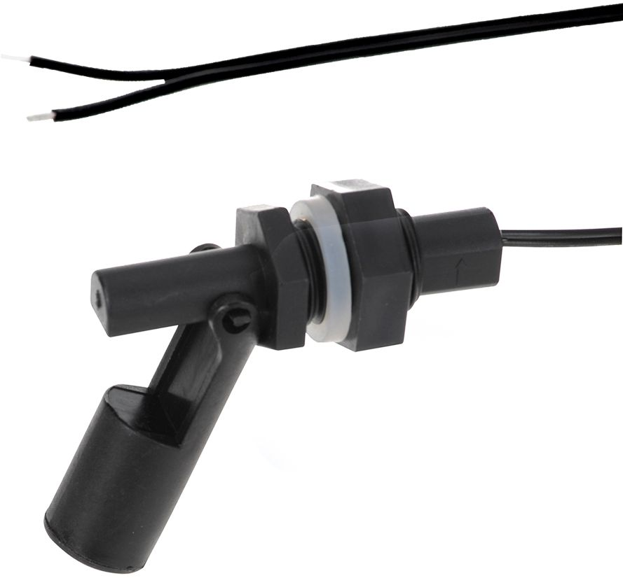
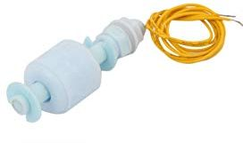

# Automatische Tonnenbefüllung #
Der Winter ist fast vorbei und so langsam sollte man wieder seinen Garten "in Betrieb" nehmen. Dazu zählt natürlich auch die Bewässerung. Bei uns im Garten haben wir für die trockenen Tage einen 600l Ibic Container als Wassertonne bestehend aus. Zum Befüllen verwenden wir das Regenwasser von unserem Hausdach. Soweit so normal. Dieser Container ist nicht gerade hübsch, deswegen wurde er weit nach hinten im Garten hinter unsere Gartenhütte verbannt. Das Wasser vom Dach muss natürlich dann auch dorthin. Deswegen läuft eine 100mm KG Rohrleitung bis hinter die Hütte. Durch das Gefälle läuft das Wasser auch gut durch die Leitung, kommt am Fuße unseres Containers an und muss dann von dort in den Container gepumpt werden.  

Als Auffangbecken und Vorfilter dient eine rechteckige 80l Mörtelwanne. Dort hinein ragt das Rohr vom Dach und von dort pumpt dann eine kleine 12V Schmutzwasserpumpe das Regenwasser in den Container. In der Wanne gibt es, neben einer Filtermatte, einen Wassserstandschalter, der bei 1/2 Füllung die Pumpe ein-ausschalten soll. Am Deckel des Containers ist ebenfalls noch ein Schwimmschalter für die "Container voll"-Anzeige angebracht. Die Software soll nun bei halber Füllung der Wanne die Pumpe einschalten, bis der Wasserstand in der Wanne wieder gesunken ist. Damit die Pumpe nicht dauernd ein-ausgeschaltet wird, soll die Pumpe 20 Sekunden nachlaufen. Das ganze Programm soll aber nur starten, wenn der Container nicht bereits voll ist.  

Gesamtanlage  

Verdrahtungsplan  

Elektronik  

## Hardware ##
Wir benötigen:

- einen Arduino Uno oder ähnlich
[https://www.az-delivery.de/collections/arduino-kompatible-boards/products/uno-r3](https://www.az-delivery.de/collections/arduino-kompatible-boards/products/uno-r3 "kompatibeles Arduino Uno R3 Board")

- 3 LEDs (rot, gelb, grün) mit Vorwiderständen 220Ohm
- 2 Widerstände 1kOhm als Pullup für die Schwimmschalter
- 1 Relaismodul ([https://www.az-delivery.de/collections/alle-produkte/products/relais-modul](https://www.az-delivery.de/collections/alle-produkte/products/relais-modul "KY-019 Relaymodul"))  

- 1 Pumpe 12V

- 1 Klapp-Schwimmschalter für die Mörtelwanne 

- 1 Pegelschalter für den Container

- einige Breadboardkabel
- 12V Laptopnetzteil
- Gehäuse, Kabel, Lüsterklemmen...

Zum Testen kann man das ganze auch erst einmal auf dem Breadboard aufbauen. Als Ersatz für die Schalter können 2 normale Taster dienen.  
Bei den ersten Versuchen hat sich schnell herausgestellt, dass, bedingt durch die Leitungslängen zu den Schwimmschaltern, eine eindeutige Erkennung nur mit Hilfe des internen Pullup Widerstandes des ATMega nicht immer möglich ist. Deswegen wurde hier über einen zusätzlichen Pin schaltbare 1KOhm Pullupwiderstand pro Schalter hinzugefügt.

## Software ##

Zunächst ein paar Besonderheiten in der Software. Das Programm ist als sog. Statemachine (Zustandsautomat) ausgeführt, s.a. [https://de.wikipedia.org/wiki/Endlicher_Automat](https://de.wikipedia.org/wiki/Endlicher_Automat "Zustandsautomat"). Das Programm kann somit nur definierte Zustände annehmen und es gibt definierte Übergänge von einem Zustand in den anderen. Leider hat sich im laufenden Betrieb herausgestellt, dass sich der Uno immer wieder mal "aufgehängt" hat. Das heißt, das Programm wurde nicht weiter verarbeitet. Deswegen habe ich dem Programm einen sog. Watchdog hinzugefügt. Dieser ist im ATMega als Hardware Timer integriert. Beim Starten wird dieser mit einer Zeitkonstante initialisiert, hier in unserem Fall mit 4s. Der Watchdog muss dann in regelmäßigen Abständen vom Programm zurückgesetzt werden. Passiert das nicht, wird automatisch ein Hardwarereset ausgelöst und der Controller startet neu. Seit dieser Implementierung arbeitet das System über Monate einwandfrei. 
Den aktuellen Code gibt's auch bei github: [https://github.com/willie68/Wassertonne](https://github.com/willie68/Wassertonne)

    /*
       Diese kleine Programm dient dazu eine Wassertonne mit Vorfilteranlage zu  steuern.
       Folgende Funktionen übernimmt das Programm.
    
       - Starten eine Wasserpumpe, wenn der Sensor im Filter einen genügenden Wasserstand meldet
       - Stoppen der Wasserpumpe mit einstellbarer Nachlaufzeit
       - Überprüfung und Ausgabe wenn der Hauptwasserspeicher voll ist.
       - Watchdog falls System in einem undefinerten Zustand gerät.
    
       Historie
       WKLA 13.07.2018
       - Watchdog implementiert
       - verschiedene Zeitkonstanten für Debug und nicht Debug version
       - Board LED als Status LED
    
       WKLA 16.06.2018
       - erste Version
    */
    #define debug
    #define mydebug
    #include <debug.h>
    #include <avr/wdt.h>
    
    // Durchgangszeit einer Loop in msec
    #define LOOP_TIME 250
    
    // Zeiten definiert in Sekunden
    #ifdef mydebug
    #define PUMP_TIME 5
    #define FULL_TIME 5
    #define WAIT_TIME 1
    #define TEST_TIME 5
    #define MAX_AUTO_RESTART 60 * 4
    #else
    #define PUMP_TIME 20
    #define FULL_TIME 60
    #define WAIT_TIME 1
    #define TEST_TIME 5
    #define MAX_AUTO_RESTART 60 * 60 * 4
    #endif
    
    // Ausgabestatus
    enum OUTPUT_STATES {
      BARREL_FULL, PUMP_ON, ALL_OFF
    };
    
    // Status des Zustandsautomaten
    enum STATUS {
      WAIT, PUMP, FULL
    };
    
    // Der aktuelle Status des Automaten
    STATUS state;
    
    // Definition der EIn/Ausgabe Pins
    const byte OUT_PULLUP = 11;
    const byte OUT_PUMP =  5;
    const byte LED_PUMP = 6;
    const byte LED_FULL = 7;
    const byte LED_STATE = 13;
    
    const byte SENS_BARREL_FULL = 8;
    const byte SENS_FILTER_FULL = 9;
    
    void setup() {
      initDebug();
    
      pinMode(OUT_PULLUP , OUTPUT);
      pinMode(OUT_PUMP , OUTPUT);
      pinMode(LED_PUMP , OUTPUT);
      pinMode(LED_FULL , OUTPUT);
      pinMode(LED_STATE , OUTPUT);
      pinMode(SENS_BARREL_FULL , INPUT_PULLUP);
      pinMode(SENS_FILTER_FULL , INPUT_PULLUP);
    
      digitalWrite(OUT_PULLUP, 1);
      digitalWrite(LED_STATE, 1);
      
    #ifdef mydebug
      digitalWrite(OUT_PUMP, 1);
      digitalWrite(LED_PUMP, 1);
      digitalWrite(LED_FULL, 1);
      delay (1000);
    #endif
      doPump(false);
      doFull(false);
      setState(WAIT);
      wdt_enable(WDTO_4S);
    }
    
    // Zeit des nächsten Statuswechsel
    int nextTime;
    // automatische Resetzeit
    long autoRestart = MAX_AUTO_RESTART; // einmal die Stunde, Rundenzeit ist etwas 250ms
    
    void loop() {
      // COunter bis zu Reset erniedrigen
      autoRestart--;
    
      // aktuellen Status ausgeben
      outputState();
    
      // Wartezeit schon verstrichen?
      if (checkWaitTime()) {
        dbgOut(", WK");
        determineState();
        switch (state) {
          case PUMP:
            doPump();
            break;
          case FULL:
            doFull();
            break;
          case WAIT:
          default:
            doWait();
        }
      }
      dbgOutLn();
      if (autoRestart > 0) {
        // wenn noch wartezeit übrig ist, dann den Watchdog triggern
        wdt_reset();
        // Led blinken
        digitalWrite(LED_STATE, !digitalRead(LED_STATE));
      } else {
        // Wartezeit verstrichen, Watchdog wird resetten
        while (true) {
          // solange hektisch blinken bitte...
          digitalWrite(LED_STATE, !digitalRead(LED_STATE));
          delay(100);
        }
      }
      delay(LOOP_TIME);
    }
    
    void doPump() {
      setOutputs(PUMP_ON);
    }
    
    void doFull() {
      setOutputs(BARREL_FULL);
    }
    
    void doWait() {
      setOutputs(ALL_OFF);
    }
    
    /*
       Status bestimmen
       FULL: Die Wassertonne ist voll
       PUMP: FIlter ist voll es muss abgepumt werden
       WAIT: sonst
    */
    void determineState() {
      if (isBarrelFull()) {
        setState(FULL);
      } else {
        if (isFilterFull()) {
          setState(PUMP);
        } else {
          setState(WAIT);
        }
      }
    }
    
    /*
     * neuen Status setzen und die entsprechende Wartezeit setzen
     */
    void setState(STATUS newState) {
      state = newState;
      dbgOut(", cs:");
      outputState();
      switch (state) {
        case WAIT:
          setNextTime(WAIT_TIME);
          break;
        case FULL:
          setNextTime(FULL_TIME);
          break;
        case PUMP:
          setNextTime(PUMP_TIME);
          break;
      }
    }
    
    /*
     * Dem Staus entsprechend die Ausgänge setzen
     */
    void setOutputs(OUTPUT_STATES outputstate) {
      dbgOut(",o:");
      switch (outputstate) {
        case ALL_OFF:
          dbgOut("off");
          doFull(false);
          doPump(false);
          break;
        case BARREL_FULL:
          dbgOut("bf");
          doFull(true);
          doPump(false);
          break;
        case PUMP_ON:
          dbgOut("pmp");
          doPump(true);
          doFull(false);
          break;
        default:
          ;
      }
    }
    
    /*
     * Wartezeit schon verstrichen?
     */
    boolean checkWaitTime() {
      int actualTime = seconds();
      if (actualTime > nextTime) {
        setState(WAIT);
        return true;
      }
      return false;
    }
    
    void setNextTime(byte secondsToWait) {
      nextTime = seconds() + secondsToWait;
    }
    
    /*
     * Ist die Hauptwassertonne schon voll?
     */
    boolean isBarrelFull() {
      return !digitalRead(SENS_BARREL_FULL);
    }
    
    /*
     * Ist der Vorfilter schon voll?
     */
    boolean isFilterFull() {
      return !digitalRead(SENS_FILTER_FULL);
    }
    
    /*
     * Pumpe ein/ausschalten
     */
    void doPump(boolean start) {
      digitalWrite(LED_PUMP, start);
      digitalWrite(OUT_PUMP, !start);
    }
    
    /*
     * Signal LED "Tonne voll" de/aktivieren
     */
    void doFull(boolean full) {
      digitalWrite(LED_FULL, full);
    }
    
    // ########## Hilfsfunktionen ###########
    int seconds() {
      return millis() / 1000;
    }
    
    void outputState() {
    #ifdef debug
      switch (state) {
        case WAIT:
          dbgOut("st: WAIT");
          break;
        case FULL:
          dbgOut("st: FULL");
          break;
        case PUMP:
          dbgOut("st: PUMP");
          break;
      }
      dbgOut(", F:");
      outputBoolean(digitalRead(SENS_FILTER_FULL));
      dbgOut(", B:");
      outputBoolean(digitalRead(SENS_BARREL_FULL));
    #endif
    }
    
    void outputBoolean(bool value) {
    #ifdef debug
      if (value) {
        dbgOut("1")
      } else {
        dbgOut("0")
      }
    #endif
    }

Viel Spass beim Nachbau.
